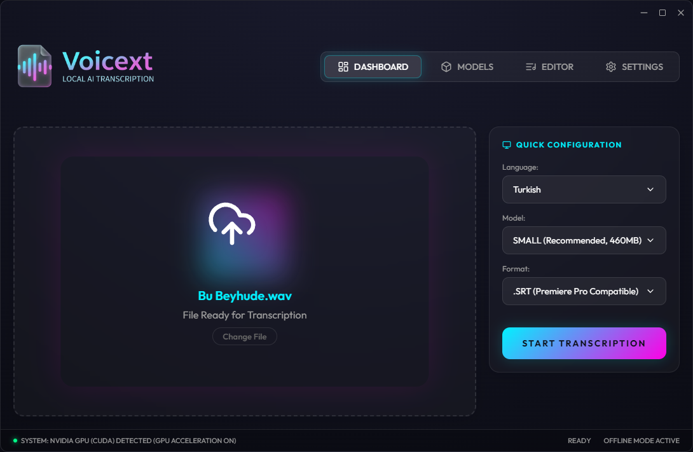
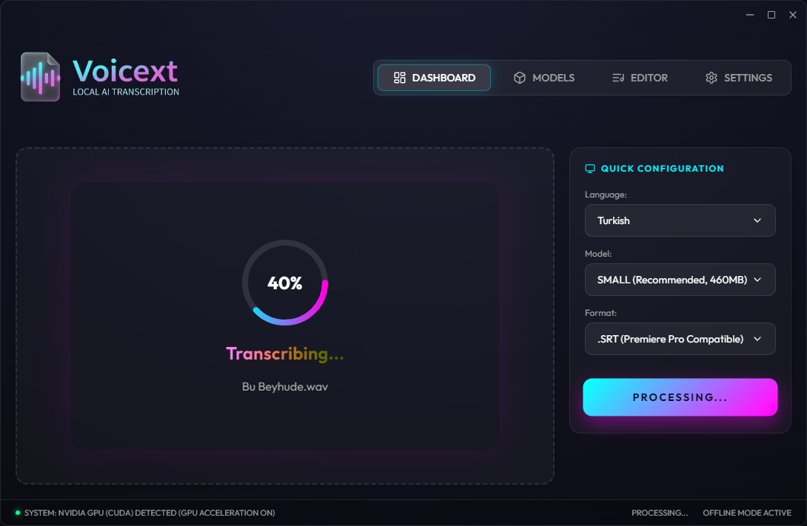
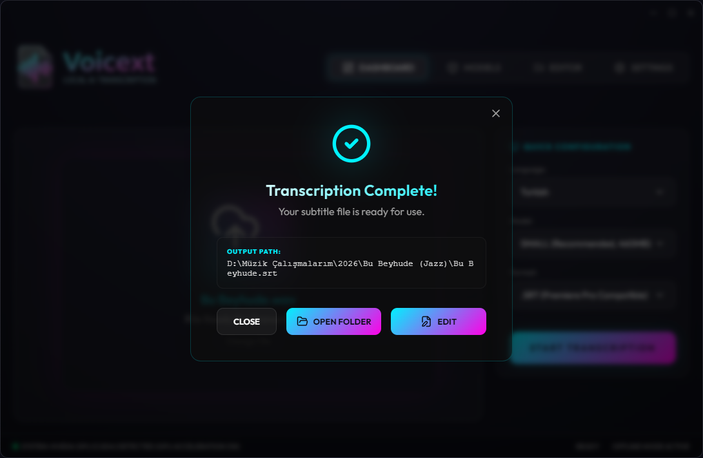
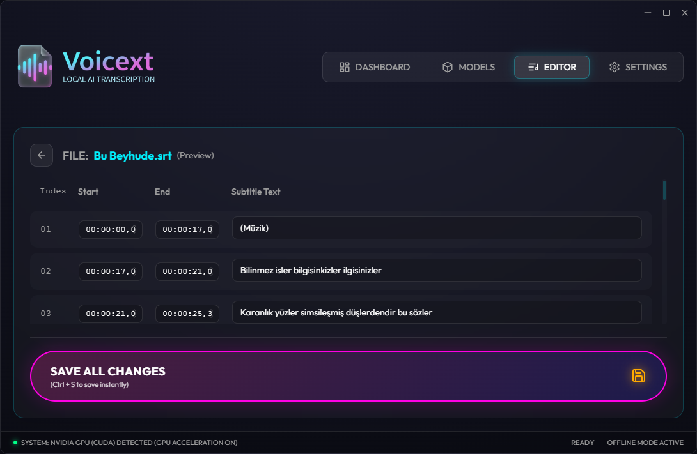
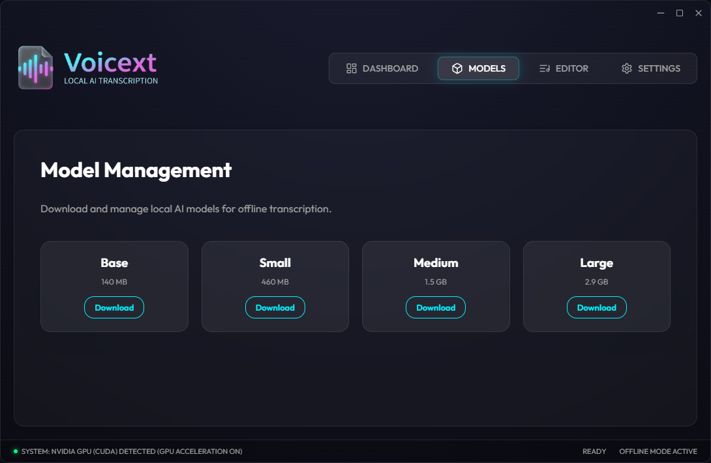
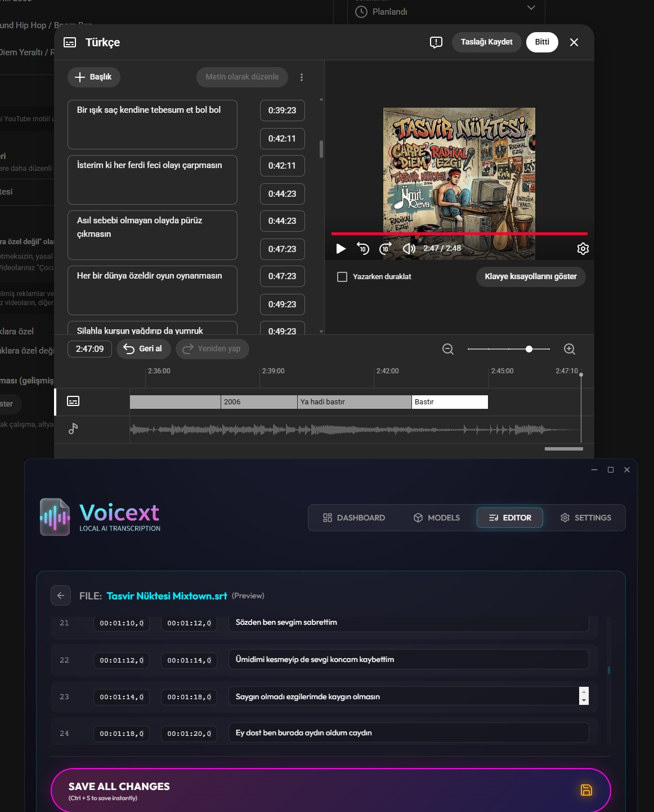

# Voicext - Local AI Transcription Tool

Voicext is a high-performance desktop application built with **Electron** and **React** that provides local, private, and fast speech-to-text transcription. It leverages the power of GPU-accelerated AI to convert audio files into professional subtitle formats.


## 📸 Screenshots

````carousel

<!-- slide -->

<!-- slide -->

<!-- slide -->

<!-- slide -->

<!-- slide -->

````

*A modern, glassmorphic UI designed for speed and clarity.*

## 🚀 Key Features

- **Local Processing:** Your data never leaves your machine. Privacy by design.
- **GPU Acceleration:** Utilizes DirectCompute and CUDA for lightning-fast transcription using the Windows-optimized Whisper implementation.
- **Built-in SRT Editor:** Edit your transcriptions instantly within the app with a real-time preview.
- **Smart SRT Fixing:** Custom algorithm to ensure SRT files are 100% compatible with Adobe Premiere Pro and other NLEs.
- **Model Management:** Download and switch between different AI models (Tiny, Base, Small, Medium, Large) directly from the interface.
- **Modern UI:** A sleek, responsive interface built with React, Tailwind CSS, and Framer Motion.
- **Turkish Optimization:** Specialized handling for Turkish character encoding and language models.

## 🧠 How It Works

The transcription process follows a robust pipeline to ensure accuracy and compatibility:

1. **Hardware Detection:** The app automatically detects if an NVIDIA GPU is available to enable hardware acceleration.
2. **Engine Initialization:** It spawns a background process using the `whisper.exe` CLI, passing the audio file and selected model.
3. **Stream Processing:** Real-time feedback is captured from the engine's stdout, providing the user with live progress updates.
4. **Post-Processing (SRT Fixer):**
   - **Timestamp Normalization:** Corrects overlapping or negative duration segments.
   - **Segment Merging:** Automatically merges micro-segments that often occur in long-form audio.
   - **Encoding Correction:** Ensures the output is UTF-8 encoded, specifically handling Turkish characters to prevent encoding errors.
   - **NLE Compatibility:** Formats the SRT specifically for high-end video editors like Adobe Premiere Pro.

## 🛠️ Technology Stack

- **Core:** [Electron](https://www.electronjs.org/)
- **Frontend:** [React](https://reactjs.org/) with [Vite](https://vitejs.dev/)
- **Styling:** [Tailwind CSS](https://tailwindcss.com/) & [Framer Motion](https://www.framer.com/motion/)
- **Engine:** [Const-me/Whisper](https://github.com/Const-me/Whisper) (Windows-optimized C++ implementation)
- **State Management:** [Zustand](https://github.com/pmndrs/zustand)

## ⚙️ Setup & Installation

### Prerequisites

- [Node.js](https://nodejs.org/) (v18 or higher)
- NVIDIA GPU (Recommended for speed, but supports CPU)

### Installation Steps

1. **Clone & Install:**
   ```bash
   git clone https://github.com/truncgil/voicext.git
   cd voicext
   npm install
   ```

2. **Setup Binaries:**
   The application requires the Whisper executable and AI models. Run the automated setup script:
   ```bash
   node scripts/setup-binaries.js
   ```

3. **Run Application:**
   ```bash
   npm run dev
   ```

## 📄 License

This project is licensed under the MIT License.

---
Developed with ❤️ by **Truncgil Software**.

